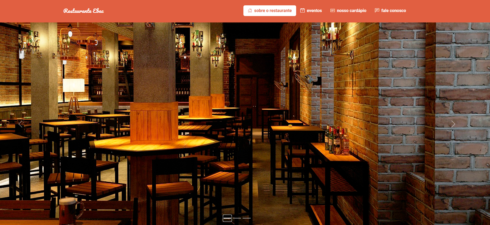

<h1 align="center"> Restaurante EBAC </h1>

 

  

## 🚀 Tecnologias

Esse projeto foi desenvolvido com as seguintes tecnologias:

- HTML, CSS, Bootstrap
- Git e Github

## 💻 Projeto

Este projeto foi feito durante as aulas do curso de Python FullStack da [EBAC](https://ebaconline.com.br/)

- [Visite o projeto online](https://restaurante-ebac-sigma.vercel.app/)

